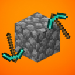

# SmoothBreak

SmoothBreak restores the block-breaking behavior from Minecraft 1.7, where switching tools mid-mining did **not** reset block break progress.

*Available on Modrinth: https://modrinth.com/mod/smoothbreak*